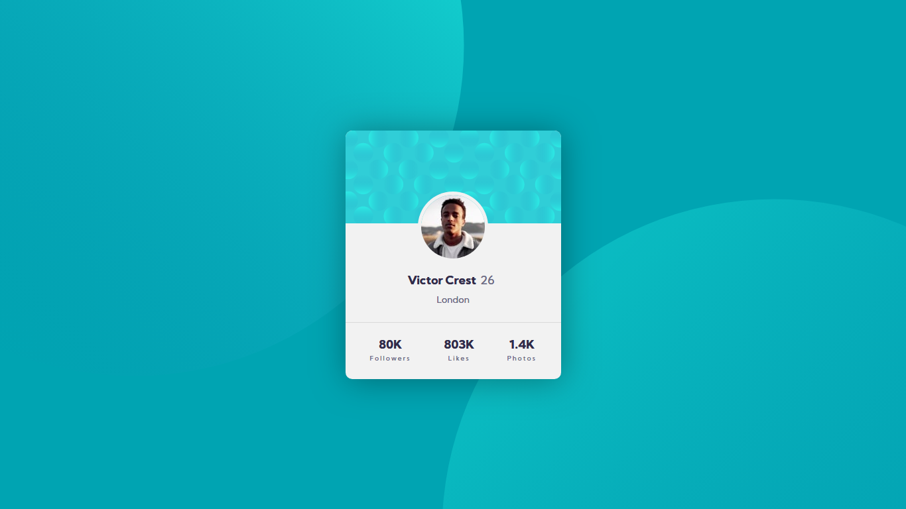

# Profile card component
## Welcome! 👋

A [Frontend Mentor](https://www.frontendmentor.io/challenges/profile-card-component-cfArpWshJ) challenge, all code is of my own while design and assests are provided by Frontend Mentor.

Written in vanilla HTML and CSS. A simple profile card componant displaying simple user content.

[View](https://profile-card-component-main-zeta.vercel.app/) the componant!

